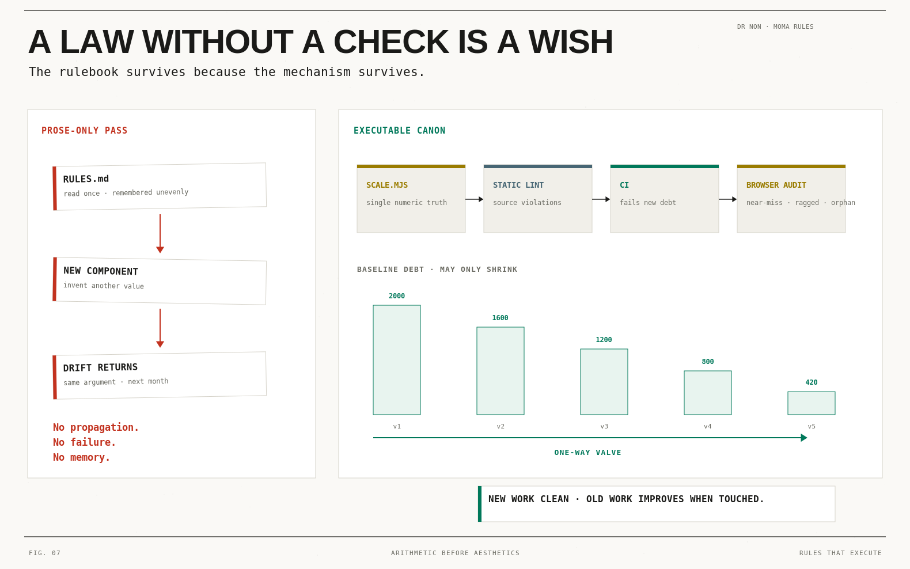

# MoMA Rules

**Dr Non's layout canon, in a form that executes.**

> "MoMA rules dictate that everything has to be aligned and there should be no
> loose edges to show that the builder is an amateur."

Three times these rules were written down as prose. Three times the pages drifted
back. This repository is the fourth attempt, and the difference is that here the
rules are **arithmetic and checks**, not advice.

**[→ The demonstration page](examples/index.html)** · **[→ The Ten Laws](LAWS.md)** ·
**[→ Why the lines still don't align](docs/why-lines-dont-align.md)** ·
**[→ Figures](docs/figures/)**



---

## The short version

| | |
|---|---|
| **Base** | 4px |
| **Spacing** | a closed set of 15 values — `0 4 8 12 16 20 24 32 40 48 64 80 96 120 160` |
| **Type** | three sizes — 11 / 14 / 32, leading 16 / 20 / 36 |
| **Grid** | 12 × 88 + 11 × 16 + 2 × 24 = **1280** |
| **Densities** | only span widths — 192 / 296 / 400 / 608 |
| **Hairline** | 1px, one colour, **and it never occupies layout space** |
| **Radius** | 0 (true circles exempt) |

## Why the last three passes failed

Measured on production, 2026-09-08 — the full forensic report is
[docs/why-lines-dont-align.md](docs/why-lines-dont-align.md):

1. **The rules were prose.** `grep -ci moma CLAUDE.md` → 0. No test, no lint, no
   CI job mentioned alignment. The one pass that happened was home-page only, and
   its own closing section lists five pages it never reached.
2. **There was no scale.** 86 distinct spacing values across `src/`, 40.1% off any
   4px grid. You cannot align 86 values with more care. The set has to close.
3. **The master origin was off-scale.** `--cockpit-x: 22px`.
4. **The hairline moved everything it framed.** A container with `border: 1px`
   lands its children 1px inside a container that uses `padding` — same intent,
   different mechanism. 124 elements on one edge, 62 on the other.
5. **Local fixes made it globally worse.** Correcting #4 live moved ten elements
   onto the origin and pushed the page's near-miss count *up*, 856 → 905, because
   the drift is ambient. Alignment cannot be repaired element by element.

## The two checks

Alignment has a static half and a runtime half, and reading code only ever
catches the first one.

### Static — runs on source, in CI

```bash
node lint/moma-lint.mjs src --strict
```

Catches `spacing-scale`, `grid-density`, `type-scale`, `radius-zero`, `hairline`.

### Runtime — runs on a laid-out page

```js
// paste audit/near-miss.browser.js into any console
```

Catches what does not exist until the browser has done layout:

- **near-miss** — edge pairs 1–6px apart. Two edges are the same or clearly
  different; the band between is the amateur mark.
- **ragged-row** — siblings in one row whose heights differ by more than 6px.
- **orphan-grid** — N items in C columns where `N % C ≠ 0`.

## Adopting it on a codebase that already has thousands of violations

Do not turn it on strict. It will be disabled within a day. Ratchet instead:

```bash
node lint/moma-lint.mjs src --update-baseline   # record today's debt
node lint/moma-lint.mjs src                     # fails only on NEW violations
```

The baseline **may only shrink**. `--update-baseline` refuses to write a larger
one, so the debt is a one-way valve: new work is clean, old work improves when
it is touched, and nobody has to stop and fix 2,000 things first.

## Self-verification

Every number published in these docs is recomputed from the source of truth:

```bash
node lint/self-check.mjs
```

It re-derives the page arithmetic, proves every divisor of 12 yields an integer
span that refills the row, and confirms all four densities resolve to a divisor
of 12 at 390 / 768 / 1024 / 1280 / 1440. A rulebook with a wrong number in it
teaches the wrong number to everyone who reads it. CI runs this, and also lints
the demonstration page — if the example ever breaks its own laws, the build fails.

## The six plates

Each law's arithmetic, plated:

| | | |
|---|---|---|
| [Fig. 02 · One Origin](docs/figures/fig-02-one-origin.png) | [Fig. 03 · Close the Set](docs/figures/fig-03-close-the-set.png) | [Fig. 04 · The Grid, Computed](docs/figures/fig-04-the-grid-computed.png) |
| [Fig. 05 · Curate to Fit the Grid](docs/figures/fig-05-curate-to-fit-the-grid.png) | [Fig. 06 · No Near Miss](docs/figures/fig-06-no-near-miss.png) | [Fig. 07 · A Law Without a Check Is a Wish](docs/figures/fig-07-law-without-a-check.png) |

Plated in [LAWS.md](LAWS.md) beside the law each one enforces. Fig. 01 (the
ten-law overview) opens [LAWS.md](LAWS.md) itself.

## Layout

```
LAWS.md                      the ten laws, each with its check
lint/scale.mjs               the single source of numeric truth
lint/moma-lint.mjs           static checker + ratchet
lint/self-check.mjs          proves the published arithmetic
audit/near-miss.browser.js   runtime checker
docs/grid.md                 the grid, fully computed
docs/why-lines-dont-align.md the forensic report
docs/figures/                the six plates, one per law
docs/styles/luggage-tag.md   a style that fits the laws
docs/moma-study.md           what MoMA actually does (primary research)
examples/index.html          the demonstration page — obeys its own laws
```

## The one law a machine cannot check

Law X — *never say a number twice*, and *hierarchy follows semantic weight*. It
is last on purpose. The other nine are automated precisely so that human
attention is left over for the one that needs it.
