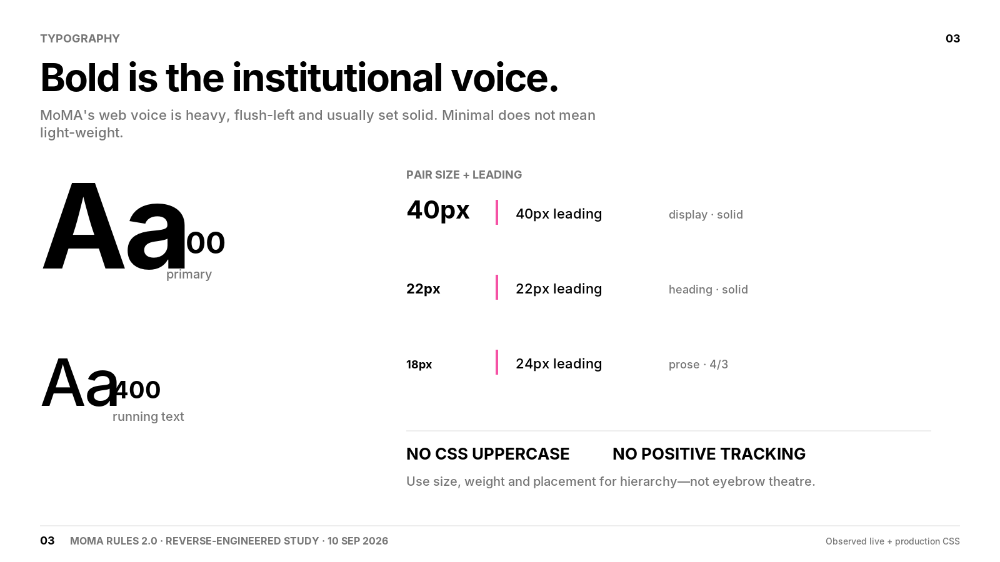
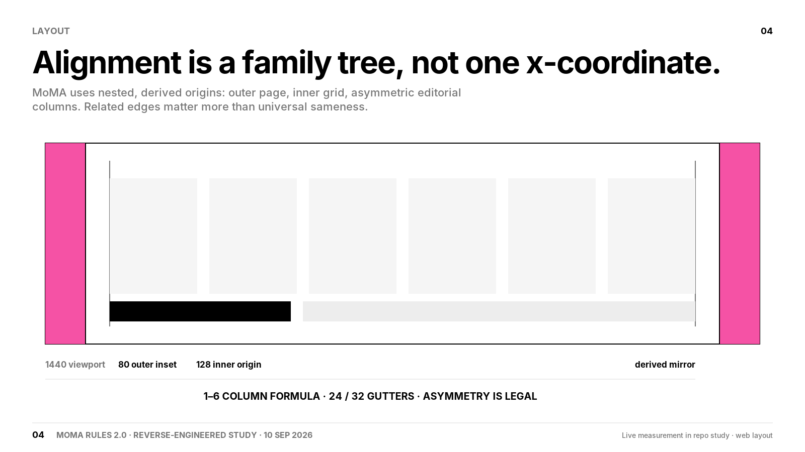
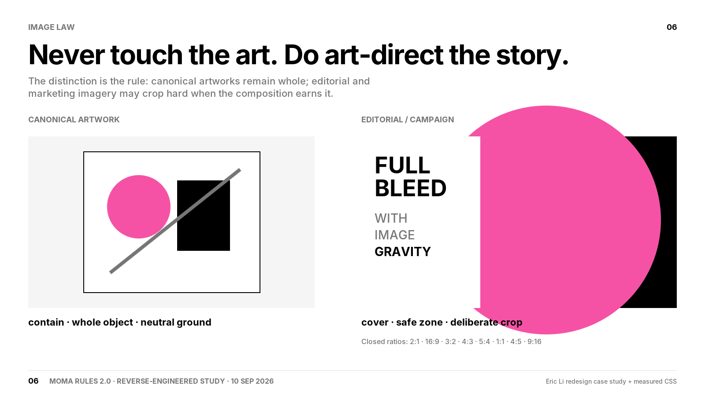
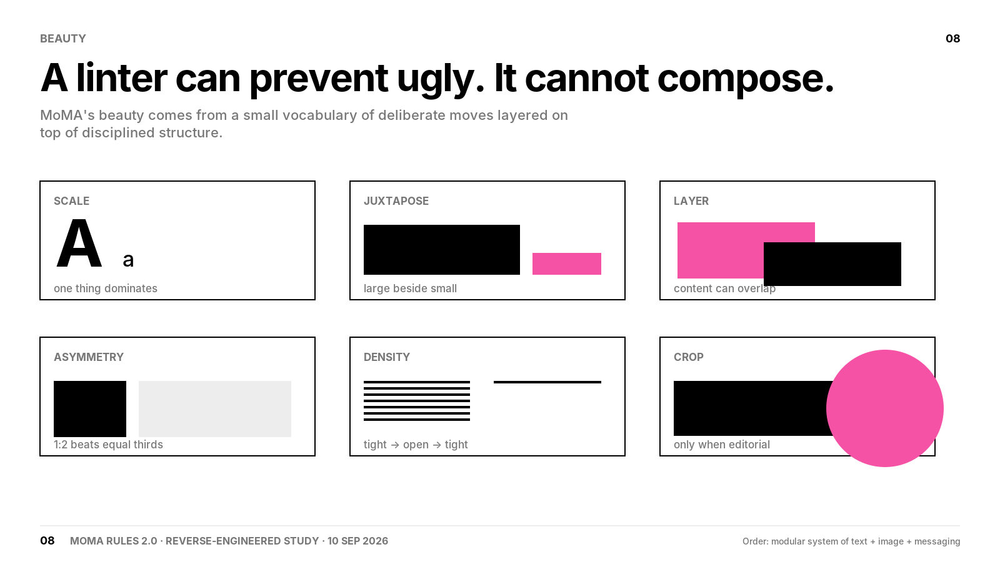
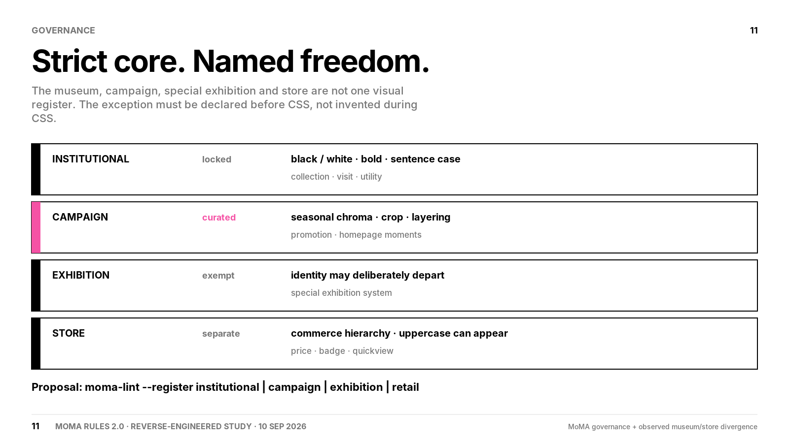
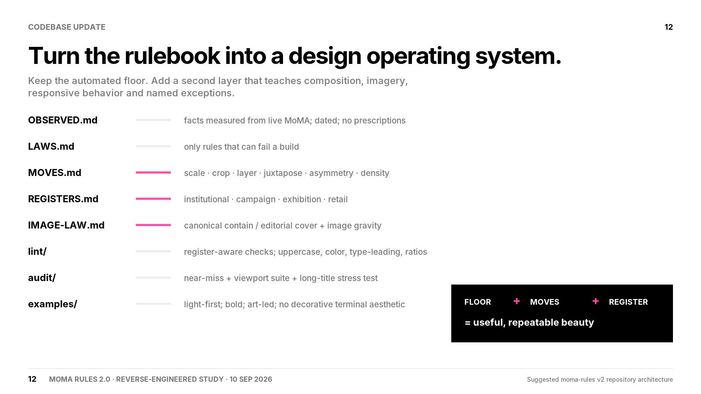
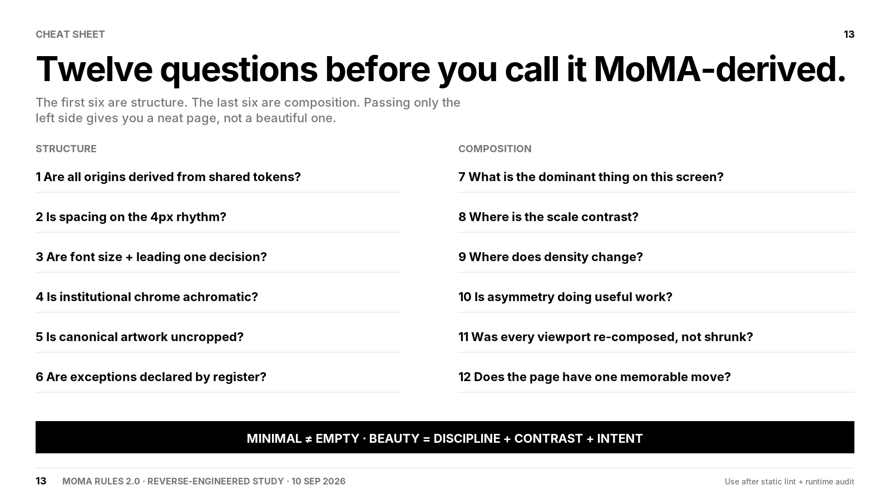

# MoMA Rules 2.0 — the study deck

**10 Sep 2026.** Seven slides of thirteen. The missing six (01, 02, 05, 07, 09,
10) were not exported; the numbering is kept so the sequence is not silently
renumbered later.

Each slide below is listed with the measured finding it rests on, so a reader can
go from the claim to the evidence without trusting the slide. Where a slide states
a number, that number is traceable to [`moma-study.md`](../moma-study.md) or to
Pentagram's own account of the 2009 system.

---

### 03 · Bold is the institutional voice

Rests on **R3b** (two weights in real use, 900 and 400, bold dominating 141:60)
and **R3a** (type set solid; only two leading ratios exist, 1.0 and 1.3333, ~86%
of text at 1.0). The pairing panel — 40/40, 22/22, 18/24 — is the paired-token
rule, and the 18/24 row is the 4/3 prose ratio.

"NO CSS UPPERCASE" is **R1**, scoped: zero `text-transform` declarations in
876KB of the *museum* site's CSS. The Design Store uses it 155 times. That scope
distinction is the whole argument for registers.

*Open question, not settled by this slide:* the repo's own type scale is 11/14/32
(Law III). The slide shows 40/22/18. Those are MoMA's sizes, not the repo's, and
`type-scale` would fail all three.

---

### 04 · Alignment is a family tree, not one x-coordinate

Rests on **R9a**: measured at 1440, the content wrapper insets 80px and the inner
grid origin lands at 128px. Both numbers appear in the study's own table
(`§1.9`), so the slide's "80 outer inset / 128 inner origin" is measured, not
drawn.

This is the slide that argues most directly against a law in force. **Law I** says
*"There is one horizontal origin per document, not one per component."* MoMA runs
two nested origins on the same page. The repo's stricter version is defensible —
it exists to kill the 1–6px near-miss band — but it should be labelled a
hardening choice rather than MoMA practice, the way Law III's three sizes already
are in [`moma-vs-us.md`](../moma-vs-us.md).

---

### 06 · Never touch the art. Do art-direct the story.

Rests on **R25** and **R9**. Pentagram's own account of the 2009 system calls for
*"dramatic cropping and juxtapositions of artwork"* and describes images as
appearing *"whole or … cropped for effect"* — and the study establishes that
cropping artwork **began** in 2009; for the museum's first eighty years an
artwork was reproduced whole.

The closed ratio set on the slide (2:1 · 16:9 · 3:2 · 4:3 · 5:4 · 1:1 · 4:5 ·
9:16) is **R9**, measured as `padding-top` values of 50 / 56.25 / 66.667 / 75 /
80 / 100 / 125 / 177.6%.

Nothing in the repository checks either half of this today.

---

### 08 · A linter can prevent ugly. It cannot compose.

The six moves — scale, juxtapose, layer, asymmetry, density, crop — are the
slide's own vocabulary. Two of them are directly Pentagram's words for the 2009
system: *"dramatic cropping and juxtapositions of artwork"*, and *"one large
image is selected as the focus"*, which is the scale move stated as policy.

This slide is the honest limit of the current repository, and it is the one the
title of `LAWS.md` already concedes: the ten laws are a floor.

---

### 11 · Strict core. Named freedom.

Rests on **R17** and **R24**, which are the two most transferable findings in the
study and the two with no mechanism at all:

- **R17** — MoMA's own numbers: **28 collection rotations locked** to the house
  face with zero discretion, **12 special exhibitions free**. The free list is
  named in advance.
- **R24** — Pentagram states it as policy: *"Individual exhibitions will continue
  to have their own identities, used in exhibition graphics, catalogues and
  websites."* Exemption is declared, not negotiated at the moment of writing.

The STORE row is the repo's own measurement, not Pentagram's — Pentagram's page
does not discuss retail at all. The study measured the Design Store separately:
155 `text-transform` uses, different weights, different leading, even a different
fallback stack.

`moma-vs-us.md` already draws the governance lesson ("lock the majority,
enumerate the exceptions in advance") and maps it onto the lint baseline. What it
does not yet have is a register flag, which is what this slide proposes.

---

### 12 · Turn the rulebook into a design operating system

The proposed file architecture. Read it together with
[`law-to-check.md`](../law-to-check.md), which argues the sequence should be
inverted: the floor this diagram builds on currently has a declared-unimplemented
check in Law I and four laws that no CI job runs.

---

### 13 · Twelve questions before you call it MoMA-derived

The proposed human gate. Questions 1–6 restate the existing laws; 7–12 are new
and are the part no linter reaches. Its footer states the intended order
explicitly: **use after static lint + runtime audit.**

---

## What the deck does not claim

The deck is a study, not a measurement. Where it states a number, that number is
traceable above. Where it states a *policy* — registers, image law, the twelve
questions — it is a proposal, and
[`proposals/v2-architecture.md`](../proposals/v2-architecture.md) is where it is
argued and where its open decisions are listed unresolved.
